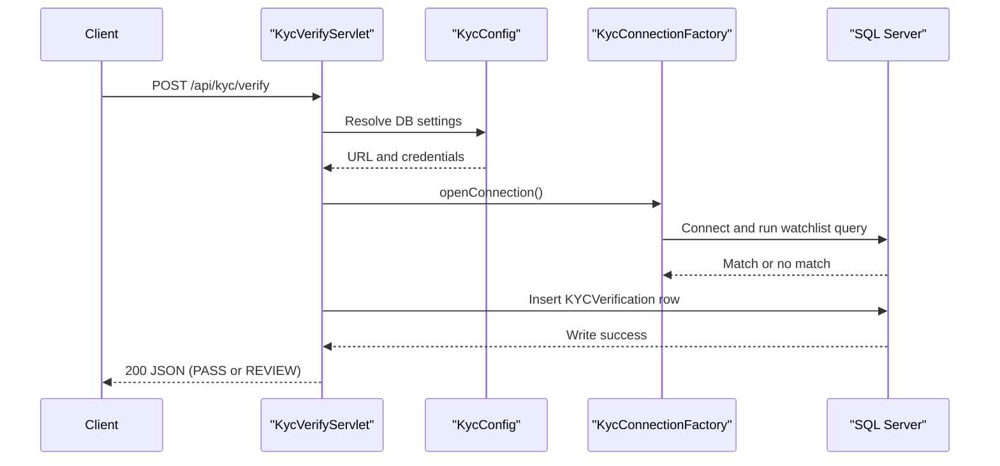

# API & Service Communication Contracts

The application exposes a small servlet-based HTTP API for KYC verification and status lookup using synchronous request/response interactions.

## Service Catalog

| Service | Port | Category | Purpose |
|---|---|---|---|
| ZavaKYCService | Container-managed (not hardcoded) | Business | Provides health, verification, and status APIs backed by SQL Server |

## API Endpoints Inventory

| Service | Method | Path | Request Type | Response Type |
|---|---|---|---|---|
| ZavaKYCService | GET | /health | None | HTML health response |
| ZavaKYCService | POST | /api/kyc/verify | JSON body (`customerId`, `fullName`, `idNumber`) | JSON verification result (`customerId`, `status`, `reason`) |
| ZavaKYCService | GET | /api/kyc/status/{customerId} | Path parameter (`customerId`) | JSON status payload or NOT_FOUND |
| ZavaKYCService | GET | /internal/bootstrap | None (startup servlet init) | Not a public contract; startup initialization |

## Management & Observability Endpoints

| Service | Endpoint | Custom Metrics (if any) |
|---|---|---|
| ZavaKYCService | /health | None detected |

## DTOs & Contracts

The API uses ad-hoc JSON payloads built with `org.json.JSONObject` rather than explicit DTO classes. Request and response contracts are currently implicit in servlet logic. No OpenAPI or protobuf schema definitions were detected.

## Communication Patterns

All calls are synchronous HTTP requests handled directly by servlets and translated into synchronous JDBC operations. No asynchronous messaging, service discovery, gateway aggregation, retry, or circuit-breaker framework was identified. No API-layer authentication, authorization, or TLS enforcement is configured in the repository.

## Service Technology Matrix

| Service | Web | Data Access | Discovery | Gateway | Actuator | Cache | Metrics |
|---|---|---|---|---|---|---|---|
| ZavaKYCService | Servlet/JSP | JDBC | None | None | Custom `/health` only | None | None |

## Service Communication Sequence

