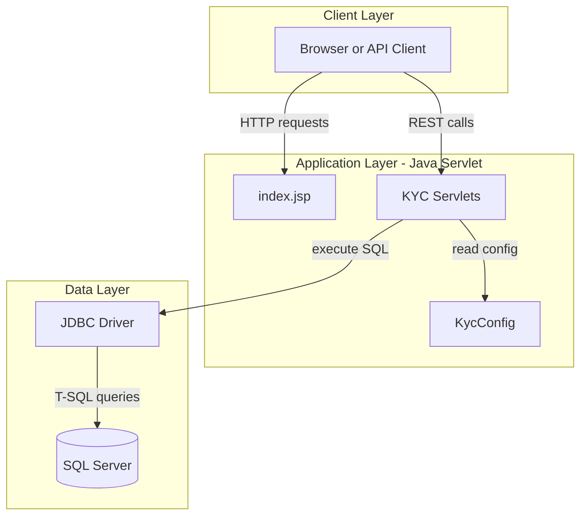
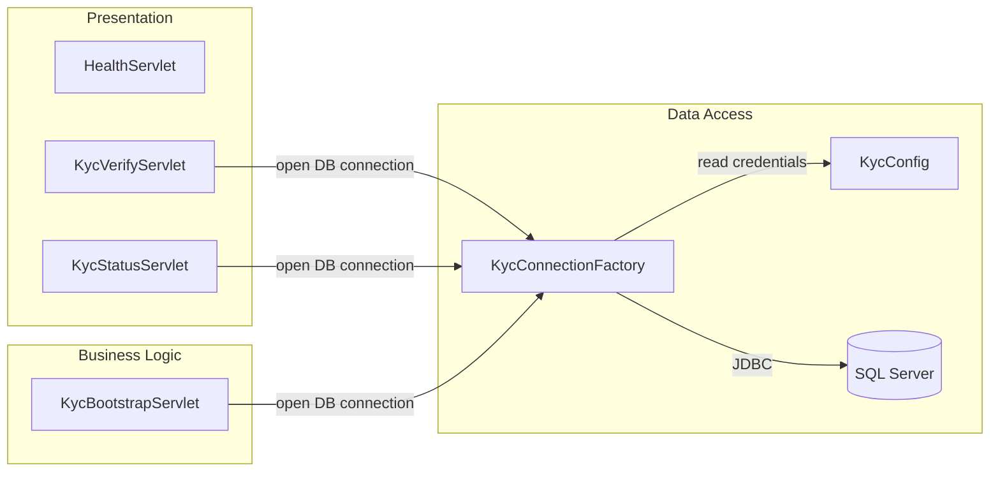

# Architecture Diagram

This service is a Java Servlet-based web application that exposes KYC APIs and persists verification data in SQL Server.

## Application Architecture

### Technology Stack Summary

| Layer | Technology | Version | Purpose |
|---|---|---|---|
| Presentation | JSP / Servlet API | Servlet 4.0 | Expose health page and KYC HTTP endpoints |
| Application | Java | 8 target | Request handling and KYC decision logic |
| Data Access | JDBC (mssql-jdbc) | 12.6.3.jre8 | SQL Server connectivity |
| Build | Gradle (java, war) | N/A | Build WAR artifact |

### Data Storage & External Services

The service stores watchlist and verification records in SQL Server tables (`KYCWatchlist`, `KYCVerification`). No additional message broker, cache, or external API integrations were detected.

### Key Architectural Decisions

- Uses classic servlet mappings in `web.xml` instead of annotation-driven controllers.
- Initializes required database tables on startup via `KycBootstrapServlet`.
- Keeps infrastructure simple with direct JDBC access and no ORM layer.

## Component Relationships

### Component Inventory

| Component | Layer | Type | Responsibility |
|---|---|---|---|
| HealthServlet | Presentation | Servlet | Returns application liveness HTML |
| KycVerifyServlet | Presentation | Servlet | Accepts verification requests and writes results |
| KycStatusServlet | Presentation | Servlet | Reads latest verification status by customer |
| KycBootstrapServlet | Business Logic | Startup Servlet | Creates required tables and seed watchlist row |
| KycConnectionFactory | Data Access | Utility | Creates SQL Server JDBC connections |
| KycConfig | Data Access | Config Utility | Resolves DB settings from env vars or properties |
