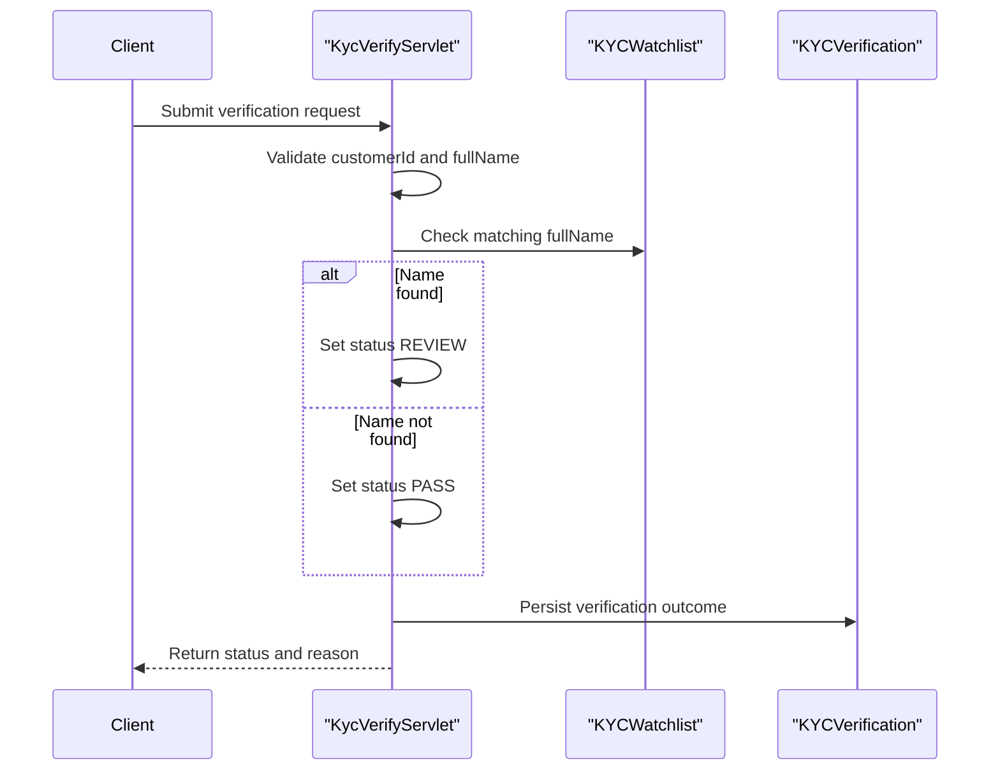

# Core Business Workflows

The service supports customer KYC checks by evaluating submitted identity data against a watchlist and storing verification outcomes for later lookup.

## Domain Entities

| Entity | Service / Bounded Context | Description | Key Relationships |
|---|---|---|---|
| KYCWatchlist | ZavaKYCService / Screening | Reference names used to trigger manual review | Used during verification checks |
| KYCVerification | ZavaKYCService / Verification | Captures verification decisions per customer | Stores result produced by verification workflow |

## Service-to-Domain Mapping

| Service | Domain Context | Owned Entities | External Dependencies |
|---|---|---|---|
| ZavaKYCService | KYC Screening and Verification | KYCWatchlist, KYCVerification | SQL Server database |

## Primary Workflows

### Workflow 1: Run KYC Verification

1. Client submits customer identity data to `/api/kyc/verify`.
2. Service validates required business inputs (`customerId`, `fullName`).
3. Service checks watchlist for exact name match.
4. Decision logic sets status to `REVIEW` when matched, otherwise `PASS`.
5. Service stores the decision and reason in verification history.
6. Client receives the computed verification outcome.

### Workflow 2: Retrieve Latest KYC Status

1. Client requests `/api/kyc/status/{customerId}`.
2. Service validates the customer identifier format.
3. Service fetches the most recent verification for the customer.
4. Response returns latest status or `NOT_FOUND` when no history exists.

## Cross-Service Data Flows

No cross-service composition pattern is implemented. All workflow steps are handled inside a single service and single database boundary.

## Business Workflow Sequence

## Business Rules & Decision Logic

- Verification requires a positive numeric `customerId` and non-empty `fullName`.
- Watchlist name match drives the decision (`REVIEW` when matched, `PASS` otherwise).
- Latest status query returns the newest verification entry ordered by verification timestamp.
- On database failures, workflows return an error response and do not expose internal exception details.
