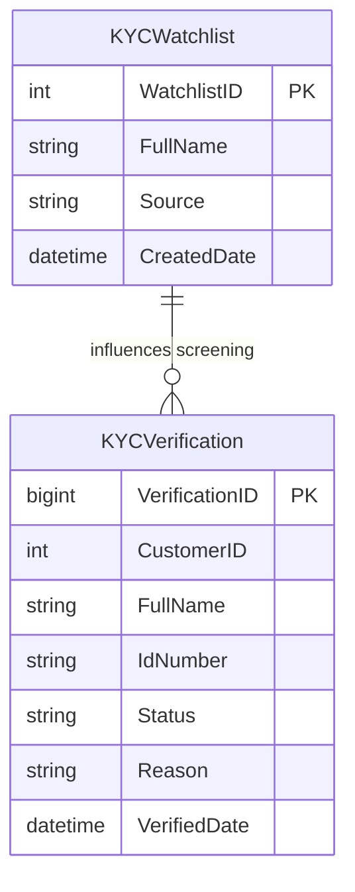

# Data Architecture & Persistence Layer

The persistence layer uses direct JDBC access to SQL Server with two core tables that support watchlist lookups and verification history.

## Database Configuration

| Service/Module | DB Type | Profile | Driver | Connection | Migration Tool |
|---|---|---|---|---|---|
| ZavaKYCService | SQL Server | Default (env override supported) | mssql-jdbc 12.6.3.jre8 | JDBC URL built from host/port/db name | None detected (startup SQL bootstrap) |

## Data Ownership per Service

| Service | Tables Owned | ORM Framework | Caching | Notes |
|---|---|---|---|---|
| ZavaKYCService | KYCWatchlist, KYCVerification | JDBC (no ORM) | None | Tables created/seeded at servlet startup |

## Entity Model

## Key Repository Methods

| Service | Repository | Notable Methods | Purpose |
|---|---|---|---|
| ZavaKYCService | `KycVerifyServlet` SQL operations | `existsInWatchlist(...)`, `insertVerification(...)` | Check watchlist and persist verification outcome |
| ZavaKYCService | `KycStatusServlet` SQL query | `SELECT TOP 1 ... ORDER BY VerifiedDate DESC` | Retrieve latest verification status by customer |
| ZavaKYCService | `KycBootstrapServlet` SQL bootstrap | Conditional `CREATE TABLE` and seed insert | Initialize schema and sample watchlist data |

## Caching Strategy

No application-level caching provider or cache annotations were detected. All reads and writes go directly to SQL Server.

## Data Ownership Boundaries

This is a single-service application with one shared database schema owned entirely by ZavaKYCService. Cross-service data exchange patterns were not detected.

### Data Classification & Sensitivity

| Entity | Sensitive Fields | Classification (PII/PHI/PCI/None) | Controls in Place |
|---|---|---|---|
| KYCVerification | FullName, IdNumber, Reason | PII | No field-level masking or encryption controls detected in code |
| KYCWatchlist | FullName | PII | No explicit controls detected in code |
