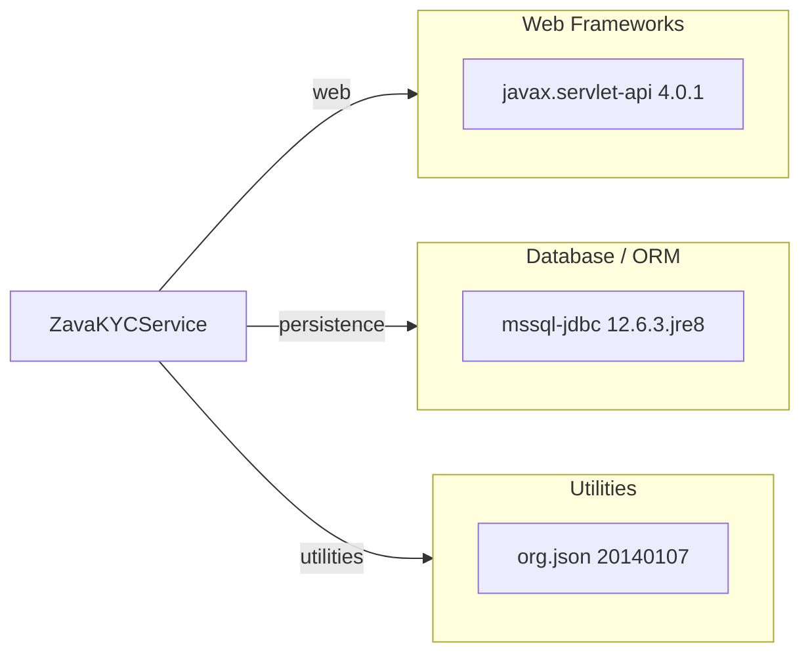

# Dependency Map

This project declares 3 main runtime dependencies in a single Gradle module and packages as a WAR file.

## Dependencies

### Dependency Summary

| Category | Count | Key Libraries | Notes |
|---|---:|---|---|
| Web Frameworks | 1 | javax.servlet-api 4.0.1 | Provided by servlet container |
| Database / ORM | 1 | mssql-jdbc 12.6.3.jre8 | Direct JDBC access to SQL Server |
| Utilities | 1 | org.json 20140107 | JSON parsing and serialization |

### Version & Compatibility Risks

`org.json:json:20140107` is very old and may require review for long-term maintenance. WAR packaging and servlet API usage imply runtime dependence on an external servlet container.

### Notable Observations

- No explicit logging dependency is declared.
- No test-scoped dependencies are declared in Gradle.
- Data access is implemented via JDBC driver without ORM abstraction.

## Test Dependencies

| Framework | Version | Notes |
|---|---|---|
| None detected | N/A | No test dependencies declared in `build.gradle` |

Total test-scope dependencies: 0
No dedicated test dependency set was detected.
