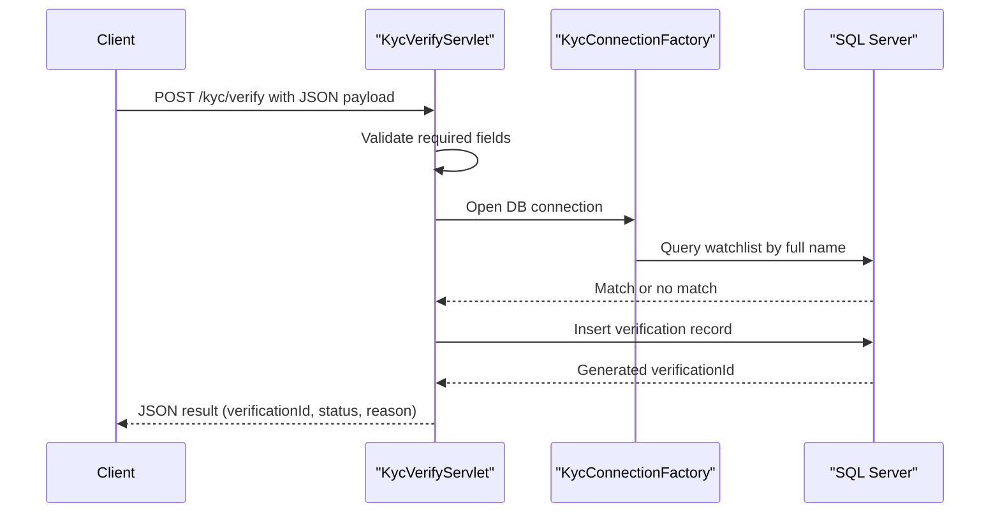

# API & Service Communication Contracts

This service exposes a compact REST-like servlet API for KYC verification and status retrieval. Communication is synchronous HTTP to servlet endpoints with synchronous JDBC operations to SQL Server.

## Service Catalog

| Service | Port | Category | Purpose |
|---|---:|---|---|
| ZavaKYCService | 8080 | API Layer | Receives KYC requests and provides health/status responses |

## API Endpoints Inventory

| Service | Method | Path | Request Type | Response Type |
|---|---|---|---|---|
| ZavaKYCService | GET | /health | None | HTML status page (200) |
| ZavaKYCService | POST | /kyc/verify | JSON body (`fullName`, `customerId`, `idNumber`) | JSON verification result or error |
| ZavaKYCService | GET | /kyc/status?id={verificationId} | Query parameter `id` | JSON verification record or error |

## Management & Observability Endpoints

| Service | Endpoint | Custom Metrics (if any) |
|---|---|---|
| ZavaKYCService | /health | None detected |

## DTOs & Contracts

Request and response contracts are dynamic JSON objects built with `org.json.JSONObject` rather than dedicated immutable DTO classes. The API contract is defined by servlet request parsing and JSON key conventions (`fullName`, `customerId`, `idNumber`, `verificationId`, `status`, `reason`, `verifiedDate`). No OpenAPI/Swagger or protobuf contract files were detected.

## Communication Patterns

Communication is synchronous only: client HTTP requests are handled by servlets, which then execute synchronous SQL queries/inserts using JDBC prepared statements. No asynchronous messaging, circuit breaker, retry policy, service discovery, or gateway aggregation layer is configured. Startup order affects availability because `KycBootstrapServlet` initializes schema during startup. API-level authentication, authorization, and TLS termination are not configured in the application code or `web.xml`, so endpoints are effectively unauthenticated at the application layer.

## Service Technology Matrix

| Service | Web | Data Access | Discovery | Gateway | Actuator | Cache | Metrics |
|---|---|---|---|---|---|---|---|
| ZavaKYCService | Servlet API | JDBC | None | No | No | None | None |

## Service Communication Sequence

