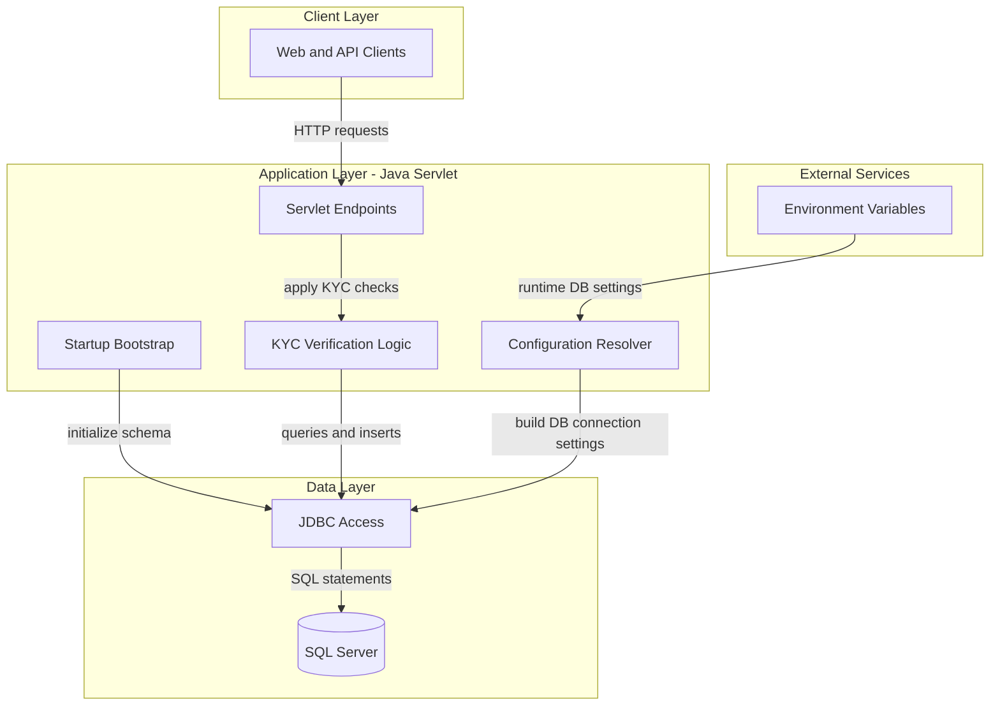
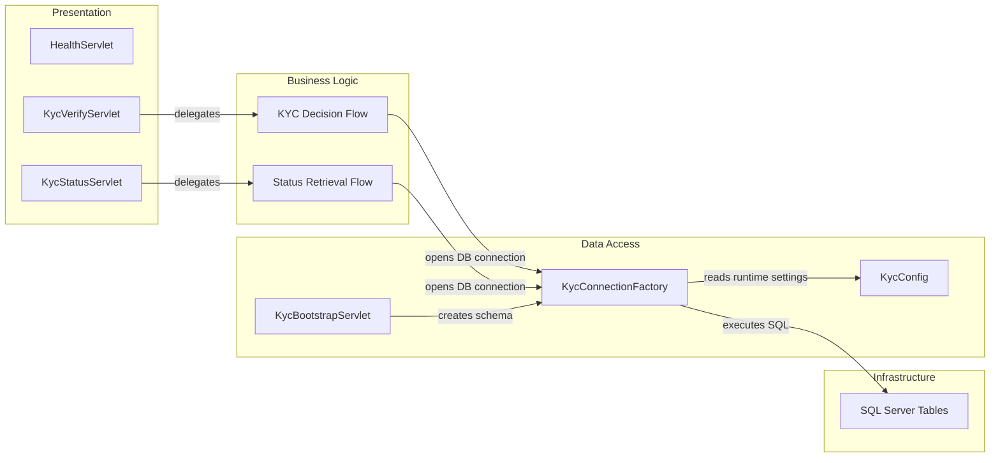

# Architecture Diagram

This application is a Java WAR-based KYC verification service with servlet endpoints backed by SQL Server. The diagrams below summarize high-level layering and key component relationships.

## Application Architecture

### Technology Stack Summary

| Layer | Technology | Version | Purpose |
|---|---|---|---|
| Presentation | Java Servlet API | 4.0.1 | HTTP endpoint handling |
| Application | Java | 8 | KYC verification and workflow logic |
| Data Access | Microsoft JDBC Driver for SQL Server | 8.4.1.jre8 | SQL Server connectivity |
| Serialization | org.json | 20231013 | JSON request and response processing |
| Packaging | Gradle WAR plugin + Tomcat runtime image | N/A | Build and deploy WAR artifact |

### Data Storage & External Services

The service persists watchlist and verification records in SQL Server through direct JDBC prepared statements. External inputs are environment variables and local property files that provide database connection details.

### Key Architectural Decisions

- Uses classic servlet mappings in `web.xml` instead of a higher-level MVC framework.
- Uses direct JDBC prepared statements for read/write paths rather than repository abstractions.
- Performs schema bootstrap and seed data insertion at servlet startup.

## Component Relationships

### Component Inventory

| Component | Layer | Type | Responsibility |
|---|---|---|---|
| HealthServlet | Presentation | Servlet | Exposes service health response |
| KycVerifyServlet | Presentation | Servlet | Accepts verification requests and stores outcomes |
| KycStatusServlet | Presentation | Servlet | Returns persisted verification results |
| KycBootstrapServlet | Data Access | Startup Servlet | Creates required tables and seeds watchlist entry |
| KycConnectionFactory | Data Access | Factory | Creates JDBC connections |
| KycConfig | Data Access | Configuration Utility | Resolves DB settings from env vars and properties |
| SQL Server Tables | Infrastructure | Data Store | Stores watchlist and verification data |
