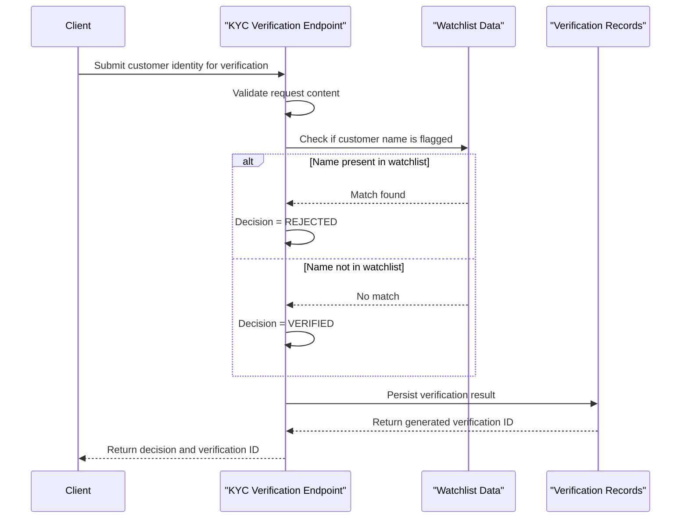

# Core Business Workflows

The application supports a KYC verification workflow where client-submitted customer identity data is screened against an internal watchlist and persisted as a verification decision. It also supports status retrieval for previously recorded verification requests.

## Domain Entities

| Entity | Service / Bounded Context | Description | Key Relationships |
|---|---|---|---|
| KYCWatchlist | KYC Processing | Internal list of flagged identities used for screening | Referenced during verification checks |
| KYCVerification | KYC Processing | Record of each verification decision and reason | Created from verification workflow; queried by status workflow |

## Service-to-Domain Mapping

| Service | Domain Context | Owned Entities | External Dependencies |
|---|---|---|---|
| ZavaKYCService | KYC Verification | KYCWatchlist, KYCVerification | SQL Server database |

## Primary Workflows

### Workflow 1: Submit KYC Verification

1. Client calls `POST /kyc/verify` with customer identity payload.
2. Service validates required values (`fullName`, `customerId`) and rejects malformed requests.
3. Service checks the watchlist for full-name matches.
4. Business decision logic sets status to VERIFIED or REJECTED.
5. Service writes verification record and returns verificationId, status, and reason.

### Workflow 2: Retrieve Verification Status

1. Client calls `GET /kyc/status?id=...`.
2. Service validates the verification identifier format.
3. Service loads persisted verification record.
4. Service returns full verification response or not-found error.

## Cross-Service Data Flows

No cross-service composition flow is present because the application is implemented as a single service with one database dependency. Data assembly occurs within the same service boundary.

## Business Workflow Sequence

## Business Rules & Decision Logic

- Requests with missing `fullName` or non-positive `customerId` are rejected as invalid input.
- KYC decision rule: exact case-insensitive match against internal watchlist causes REJECTED status; otherwise VERIFIED.
- Each request creates an immutable audit-style verification record with reason and timestamp.
- Status lookup requires a valid numeric identifier and returns not-found when no record exists.
