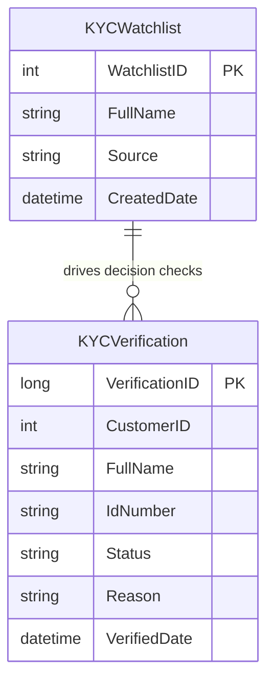

# Data Architecture & Persistence Layer

The data layer is centered on SQL Server and direct JDBC persistence with two core tables for watchlist and verification records. No ORM, repository framework, or distributed caching layer is in use.

## Database Configuration

| Service/Module | DB Type | Profile | Driver | Connection | Migration Tool |
|---|---|---|---|---|---|
| ZavaKYCService | SQL Server | Default runtime | mssql-jdbc 8.4.1.jre8 | JDBC URL composed from env/properties (`jdbc:sqlserver://...`) | Startup SQL in `KycBootstrapServlet` |

## Data Ownership per Service

| Service | Tables Owned | ORM Framework | Caching | Notes |
|---|---|---|---|---|
| ZavaKYCService | KYCWatchlist, KYCVerification | None (plain JDBC) | None | Single service owns all tables in same schema |

## Entity Model

## Key Repository Methods

| Service | Repository | Notable Methods | Purpose |
|---|---|---|---|
| ZavaKYCService | Inline JDBC in `KycVerifyServlet` | Prepared watchlist lookup by full name | Determine verification decision |
| ZavaKYCService | Inline JDBC in `KycVerifyServlet` | Insert verification record with generated ID | Persist KYC outcome |
| ZavaKYCService | Inline JDBC in `KycStatusServlet` | Select verification by ID | Retrieve verification status |

## Caching Strategy

No application-level cache provider or cache-aside/read-through pattern was detected. All reads and writes are served directly against SQL Server.

## Data Ownership Boundaries

The project uses a single shared data store owned by one service boundary. Cross-service data exchange patterns are not present because there is only one deployable service and no separate bounded contexts.

### Data Classification & Sensitivity

| Entity | Sensitive Fields | Classification (PII/PHI/PCI/None) | Controls in Place |
|---|---|---|---|
| KYCWatchlist | FullName | PII | No explicit masking/encryption controls in code |
| KYCVerification | CustomerID, FullName, IdNumber | PII | No explicit masking/encryption controls in code |
