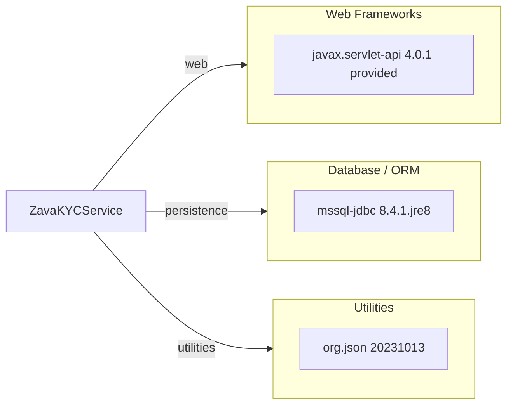

# Dependency Map

This project declares 3 primary runtime dependencies in its Gradle build and packages as a servlet WAR.

## Dependencies

### Dependency Summary

| Category | Count | Key Libraries | Notes |
|---|---:|---|---|
| Web Frameworks | 1 | javax.servlet-api 4.0.1 | Provided by servlet container |
| Database / ORM | 1 | mssql-jdbc 8.4.1.jre8 | Direct SQL Server access via JDBC |
| Utilities | 1 | org.json 20231013 | JSON parsing and response building |

### Version & Compatibility Risks

The runtime is Java 8 while assessment config targets newer modern runtimes, which may require dependency and build-script updates during modernization. The JDBC driver and servlet API should be reviewed for compatibility with target runtime/container combinations.

### Notable Observations

- Dependency surface is intentionally small with only core runtime libraries.
- No dedicated logging, metrics, or security framework dependency is declared.
- No test-scoped dependencies are defined in `build.gradle`.

## Test Dependencies

No test dependencies detected.

Total test-scope dependencies: 0
No explicit test infrastructure dependencies are currently declared in the build file.
